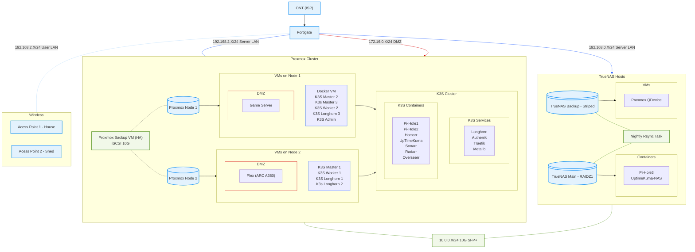

# Terraform + K3S Homelab Adventures

Welcome to my journey into using **Terraform** to automate and manage my K3S-powered Kubernetes homelab! This project documents my experiments, learnings, and ongoing progress as I bring modern infrastructure-as-code tools into my personal environment.

## Table of Contents

- [About This Project](#about-this-project)
- [Homelab Diagram](#homelab-diagram)

## About This Project

This repository contains my experiments with using **Terraform** to define, provision, and manage services in my (K3S) homelab cluster. My ultimate goal is to codify the configuration and setup process, making environments reproducible and easy to share or rebuild.

## Homelab Diagram

